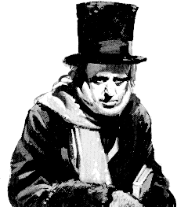

Scrooge
=======

Scrooge is a `thrift <http://thrift.apache.org/>`_ code generator written in
Scala, which currently generates code for Scala and Java.

It's meant to be a replacement for the apache thrift code generator, and
generates conforming, binary-compatible codecs by building on top of
libthrift.

Since Scala is API-compatible with Java, you can use the apache thrift code
generator to generate Java files and use them from within Scala, but the
generated code uses Java collections and mutable "bean" classes, causing some
annoying boilerplate conversions to be hand-written. This is an attempt to
bypass the problem by generating Scala code directly. It also uses Scala
syntax so the generated code is much more compact.

There is a fairly comprehensive set of unit tests, which actually generate
code, compile it, and execute it to verify expectations.

Features
--------

- Generates native Scala thrift codecs

- Generated code is templated using a mustache variant, making it easy to
  edit.

- Finagle client/server adaptors can be optionally generated at the same time.

- Has a plugable backend providing a dynamic way to add more generator targets.

Using Scrooge
-------------

There are a couple of classes needed by the generated code. These have been
moved out of scrooge into a separate jar to keep dependencies small.
Maven users need to add the following to the pom.xml file:

::

    <dependency>
      <groupId>com.twitter</groupId>
      <artifactId>scrooge-core_2.9.2</artifactId>
      <version>3.3.2</version>
    </dependency>

SBT users need this:

::

    val scroogeCore = "com.twitter" %% "scrooge-core" % "3.3.2"

Building Scrooge
----------------

To build scrooge, use sbt:

::

    $ ./sbt +publish-local

User's guide
------------

.. toctree::
   :maxdepth: 4

   Namespaces
   SBTPlugin
   MVNPlugin
   CommandLine
   Finagle
   Ostrich
   CodeGenDep
   Symantics

Notes
-----

.. toctree::
   :maxdepth: 2

   changelog
   license
